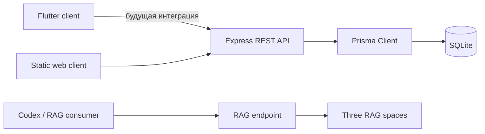

# Архитектура MED SPRAVOCHNIK

## Обзор

Система состоит из трёх пользовательских поверхностей и общего предметного контура:

Статический клиент обслуживается тем же Express-приложением. Flutter-клиент сейчас работает автономно на локальных данных.

## Backend

- `src/server.ts` запускает HTTP-сервер.
- `src/app.ts` собирает middleware, статические файлы и маршруты.
- `src/config/env.ts` валидирует окружение через Zod.
- `src/shared/prisma.ts` содержит единый экземпляр Prisma Client.
- `src/shared/middleware/` отвечает за JWT, роли и единый формат ошибок.
- `src/modules/` группирует маршруты по предметным областям.
- `src/rag/` хранит документы и поиск RAG.

Поток запроса: Express → Zod validation → auth/admin middleware при необходимости → Prisma или вычисление → JSON response → error middleware.

## Данные

SQLite используется как локальная база MVP. Prisma-модели:

- `User`: учётная запись и роль;
- `Drug`: сведения о препарате;
- `Disease`: заболевание и код МКБ-10;
- `Article`: публикуемый клинический материал.

Поля `analogs` и `tags` временно хранят JSON-массивы в строках. Для production следует нормализовать их либо в связанные таблицы, либо перейти на БД с нативным JSON.

## Flutter

Flutter-клиент организован по feature-first структуре. Riverpod предоставляет зависимости и локальное состояние, GoRouter отвечает за маршрутизацию, SharedPreferences сохраняет пользовательские настройки.

`MedicalRepository` является границей данных. Сейчас используется `OfflineMedicalRepository`; сетевой репозиторий должен реализовать тот же интерфейс и преобразовывать API DTO в domain-модели.

## Безопасность

- пароли хешируются `bcryptjs`;
- JWT действует 30 дней;
- изменяющие операции требуют `ADMIN`;
- Zod проверяет входные данные;
- `.env` исключён из Git.

Перед production-релизом нужны refresh-токены или сокращённый TTL, rate limiting, security headers, ограниченный CORS, аудит административных изменений и политика ротации секретов.

## Следующие архитектурные шаги

1. Подключить Flutter к REST API через remote repository.
2. Добавить миграции и seed вместо одного `db push`.
3. Завершить CRUD, пагинацию и сортировку.
4. Ввести версионирование медицинского контента и редакционный workflow.
5. Покрыть формулы калькуляторов unit-тестами.
6. Перенести production-хранилище на PostgreSQL и добавить полнотекстовый поиск.
