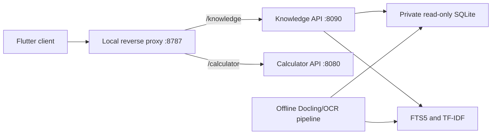

# Архитектура

## Knowledge API

FastAPI читает SQLite через `mode=ro` и `PRAGMA query_only=ON`. Retrieval
объединяет FTS5, TF-IDF, entities и metadata. Neural vectors и генерация LLM в
текущей версии не включены.

## Calculator API

Калькуляторы являются отдельным вычислительным продуктом. Их формулы,
валидация, тесты и provenance не зависят от OCR-корпуса.

## Flutter

Клиент получает каталог калькуляторов, схемы форм, результаты вычислений,
каталог протоколов, поисковые evidence и presentation blocks.

## Preview

`preview-codeplace` является третьим, полностью изолированным приложением. Оно
имитирует основные HTTP-контракты на трех synthetic-документах и двух
калькуляторах. Production-код и данные при этом не изменяются.

## Архив

Предыдущий Express/Prisma/PostgreSQL MVP перемещен в `archive`. Он не импортируется
активным кодом, не запускается CI и не является источником медицинских данных.
